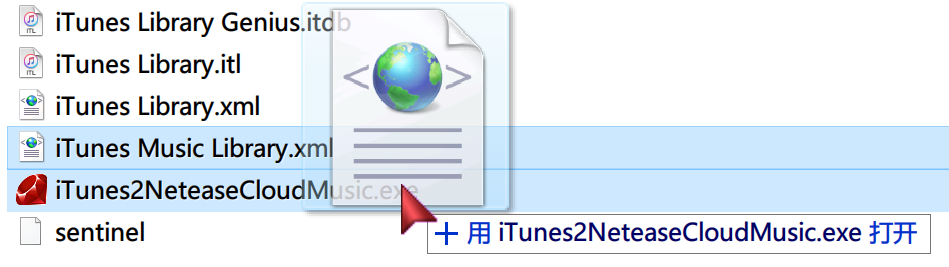
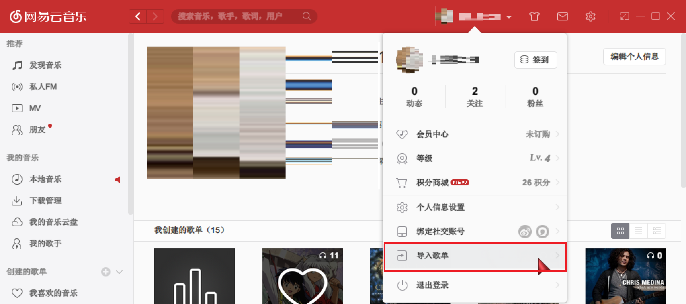

## 软件说明：
把Windows版iTunes音乐播放列表导入到网易云音乐中

## 使用方法：
### 1.生成音乐播放列表文件
### 最简单的办法：
找到iTunes 库文件iTunes Music Library.xml的文件夹
把iTunes2NeteaseCloudMusic.exe复制到此文件夹
单击iTunes Music Library.xml，拖拽到iTunes2NeteaseCloudMusic.exe上面，如图示：

### 命令行方法：
打开cmd
在指定路径下运行`iTunes2NeteaseCloudMusic.exe "iTunes 库文件iTunes Music Library.xml的绝对路径"`
> 说明：
由于Windows版iTunes资料库文件名含有空格，请务必保留双引号。

### 2.导入到网易云音乐操作步骤
1.打开网易云音乐，在个人名称栏单击，出现弹出菜单，点击`导入歌单`菜单

2.选择酷狗音乐

3.上传播放列表
